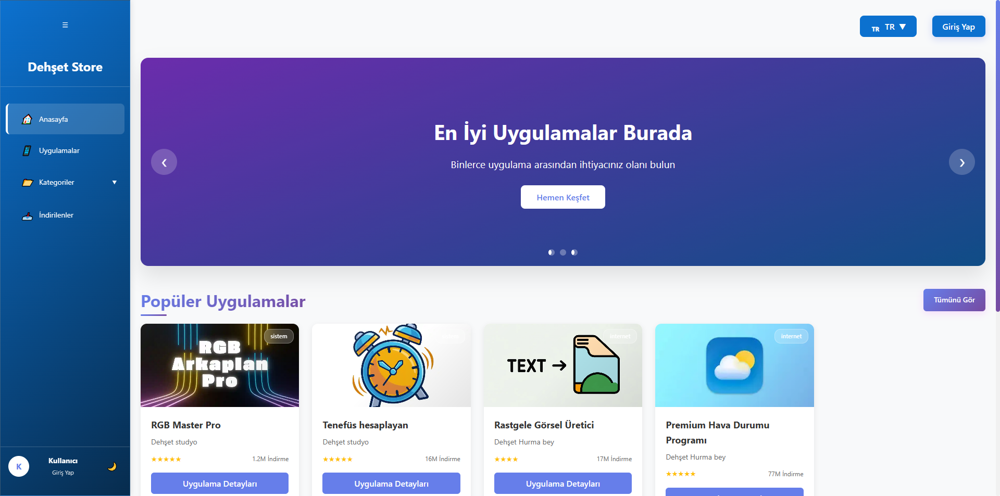
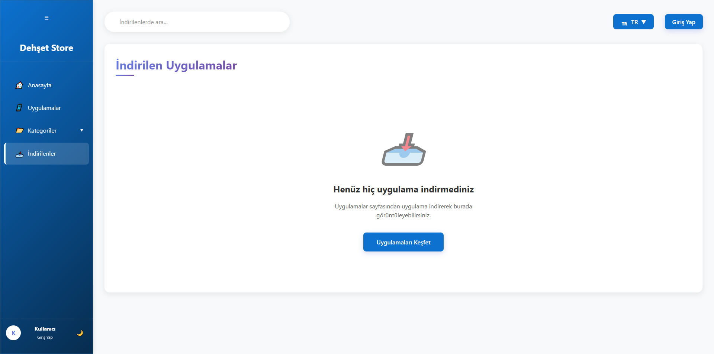
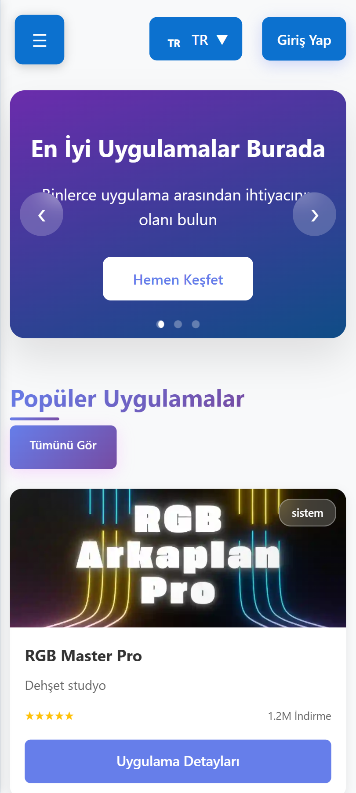
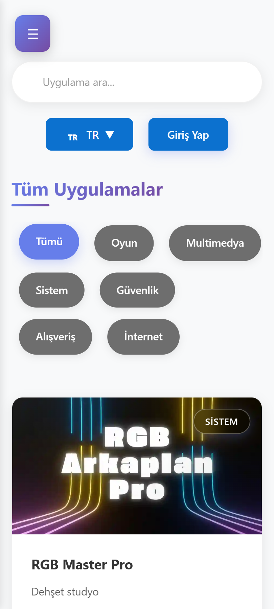
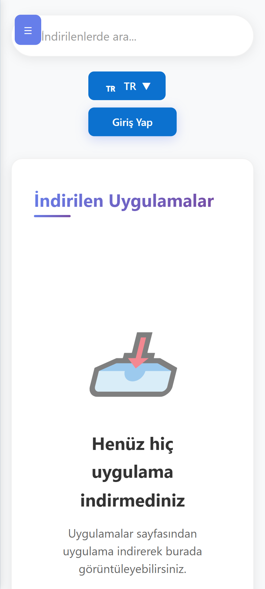

<div align="center">

<a href="http://dehsetstore.rf.gd">

</a>

<br/>

[](#)
[](#)
[](#)
[](#)
[](#)

<br/>

[](#)
[](LICENSE)
[](#)
[](#)

<br/>

<a href="http://dehsetstore.rf.gd">
  
</a>

</div>

<br/>


<br/>

## 🧭 İçindekiler

<div align="center">

[`⚡ Özellikler`](#-özellikler) &nbsp;·&nbsp;
[`🛠️ Teknolojiler`](#️-teknoloji-yığını) &nbsp;·&nbsp;
[`📸 Ekranlar`](#-ekran-görüntüleri) &nbsp;·&nbsp;
[`📂 Yapı`](#-proje-yapısı) &nbsp;·&nbsp;
[`🚀 Kurulum`](#-kurulum) &nbsp;·&nbsp;
[`📄 Lisans`](#-lisans)

</div>

<br/>


<br/>

## ⚡ Özellikler

<br/>

<div align="center">

| 🎮 &nbsp; Dijital Ürün Sistemi | 🔐 &nbsp; Güvenli Kimlik |
|:---|:---|
| Oyun kodları, yazılım lisansları ve premium dijital içeriklerin anlık teslimatı. | Rol tabanlı yetkilendirme, şifreli oturum ve güvenli admin erişimi. |

| 📱 &nbsp; Tam Responsive | ⚡ &nbsp; Yüksek Performans |
|:---|:---|
| Masaüstünden mobile, her ekran boyutunda kusursuz görünüm. | Optimize DB sorguları ve hafif frontend mimarisiyle ışık hızı yükleme. |

| 🗂️ &nbsp; Dinamik Katalog | 📊 &nbsp; Admin Paneli |
|:---|:---|
| Kategori filtreli, aranabilir ve gerçek zamanlı stok takipli ürün listeleme. | Ürün ekle, siparişleri takip et, kullanıcıları yönet — tek ekrandan. |

</div>

<br/>


<br/>

## 🛠️ Teknoloji Yığını

<br/>

<div align="center">


<br/><br/>

| Katman | Teknoloji | Görev |
|:---:|:---:|:---|
| **Frontend** |    | Arayüz, animasyon ve kullanıcı etkileşimi |
| **Backend** |  | Sunucu mantığı, API ve iş akışları |
| **Veritabanı** |  | Veri depolama, sipariş ve kullanıcı yönetimi |
| **Sunucu** |   | HTTP, yönlendirme ve güvenlik katmanı |

</div>

<br/>


<br/>

## 📸 Ekran Görüntüleri

<br/>

### 💻 Masaüstü

<details>
<summary><b>&nbsp;🌐&nbsp; Ana Sayfa & Vitrin</b> &nbsp;— tıkla ve gör</summary>
<br/>

<br/><br/>
</details>

<details>
<summary><b>&nbsp;📥&nbsp; İndirilenler Sayfası</b> &nbsp;— tıkla ve gör</summary>
<br/>

<br/><br/>
</details>

<details>
<summary><b>&nbsp;📦&nbsp; Ürün Kataloğu</b> &nbsp;— tıkla ve gör</summary>
<br/>

<br/><br/>
</details>

<br/>

### 📱 Mobil Arayüz

<p align="center">
  
  &nbsp;&nbsp;
  
  &nbsp;&nbsp;
  
</p>
<p align="center">
  <sub>
    🏠 <b>Ana Sayfa</b> &nbsp;·&nbsp;
    📂 <b>Kategori</b> &nbsp;·&nbsp;
    📥 <b>İndirmelerim</b>
  </sub>
</p>

<br/>


<br/>

## 📂 Proje Yapısı

```
🗂  dehsetstore/
│
├── 📁 images/              → Ürün görselleri ve medya dosyaları
├── 📁 screenshots/         → README ekran görüntüleri
│
├── 📁 sistem/              → Çekirdek sistem & yapılandırma
│   └── config.php          → DB bağlantı ve uygulama ayarları
│
├── 📁 uygulamalar/         → Modüller ve iş mantığı
│
├── 📄 index.php            → Ana giriş noktası
├── 📄 login.php            → Oturum açma
├── 📄 register.php         → Kullanıcı kaydı
└── 📄 README.md            → Proje dokümantasyonu
```

<br/>


<br/>

## 🚀 Kurulum

**Gereksinimler:** `PHP 8.0+` &nbsp;·&nbsp; `MySQL 5.7+` &nbsp;·&nbsp; `Apache` veya `Nginx`

```bash
# ① Repoyu klonla
git clone https://github.com/kullanici-adi/dehsetstore.git
cd dehsetstore

# ② Veritabanını oluştur
mysql -u root -p -e "CREATE DATABASE dehsetstore CHARACTER SET utf8mb4 COLLATE utf8mb4_unicode_ci;"

# ③ Tabloları içe aktar
mysql -u root -p dehsetstore < sistem/database.sql

# ④ Yapılandırmayı düzenle  →  sistem/config.php
#    DB_HOST, DB_NAME, DB_USER, DB_PASS değerlerini gir

# ⑤ Yerel geliştirme ortamını başlat
php -S localhost:8000
```

> [!NOTE]
> `sistem/config.php` dosyasındaki veritabanı bağlantı bilgilerini kendi sunucu ortamınıza göre düzenlemeyi unutmayın. Üretim ortamı için `.htaccess` ile dizin erişimini kısıtlayın.

<br/>


<br/>

## 📄 Lisans

Bu proje **Apache License 2.0** kapsamında lisanslanmıştır — ayrıntılar için [`LICENSE`](LICENSE) dosyasına bakınız.

<br/>


<div align="center">

<a href="http://dehsetstore.rf.gd">
  
</a>

<br/>

[](http://dehsetstore.rf.gd)

<sub>© 2026 Dehşet Store · Tüm hakları saklıdır.</sub>

</div>
